# 🐾 Churu Paw Shop

고양이를 위한 츄르 판매 및 재고 관리 웹 프로젝트입니다.

## 📌 프로젝트 소개

Churu Paw Shop은 관리자와 회원의 역할을 구분하여 츄르 상품을 관리하고 구매할 수 있는 웹 프로젝트입니다.

현재 HTML, CSS, Bootstrap을 활용하여 화면을 구현하였으며, 추후 Java, Oracle DB를 연동하여 실제 동작하는 웹 서비스로 확장할 예정입니다.

---

## 👨‍💼 관리자 기능

- 로그인
- 관리자 대시보드
- 츄르 등록
- 입고 등록
- 재고 현황 조회
- 판매 내역 조회
- 회원 조회

---

## 🐱 회원 기능

- 회원가입
- 로그인
- 회원 대시보드
- 츄르 구매
- 구매 내역 조회
- 내 정보 조회

---

## 🛠 기술 스택

### Front-End

- HTML5
- CSS3
- Bootstrap 5

### Back-End (예정)

- Java

### Database (예정)

- Oracle Database

---

## 🖥 구현 화면

### 공통

- 홈 화면
- 로그인
- 회원가입

### 관리자

- 관리자 대시보드
- 츄르 등록
- 입고 등록
- 재고 현황
- 판매 내역
- 회원 조회

### 회원

- 회원 대시보드
- 츄르 구매
- 구매 내역
- 내 정보

---

## 📷 프로젝트 화면

### 🏠 홈 화면

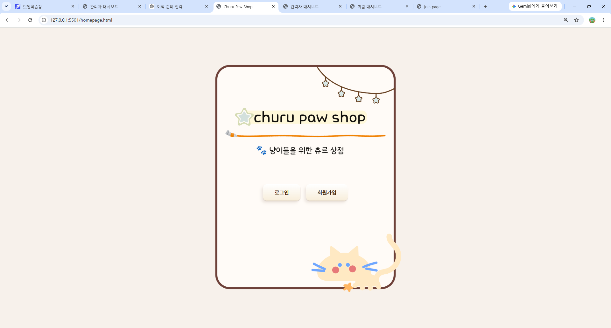

### 🔐 로그인

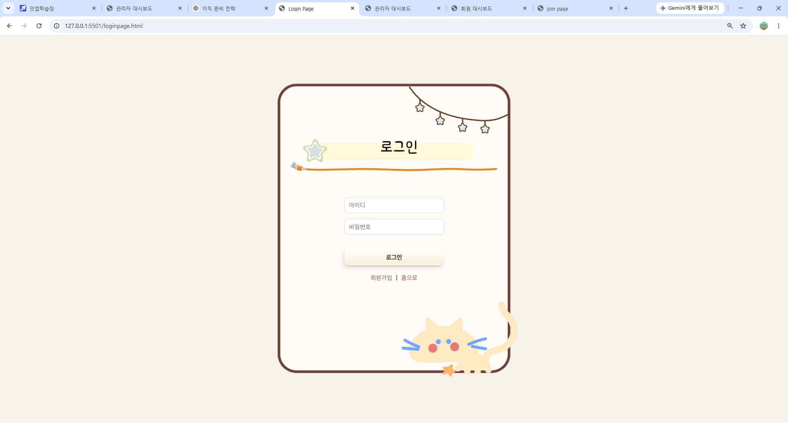

### 📝 회원가입

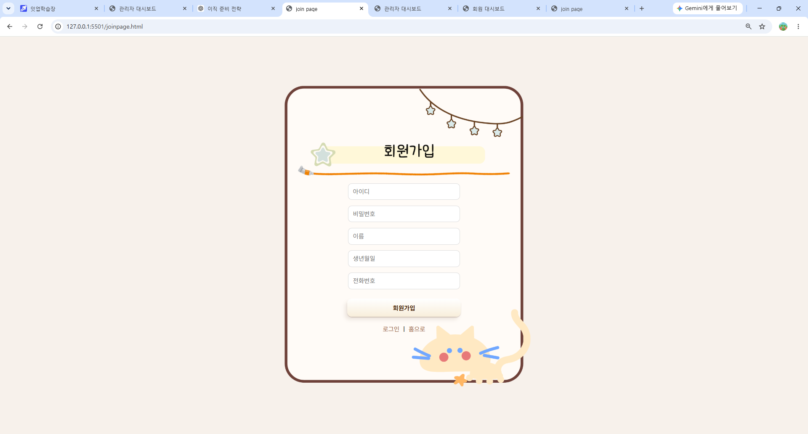

### 👨‍💼 관리자 대시보드

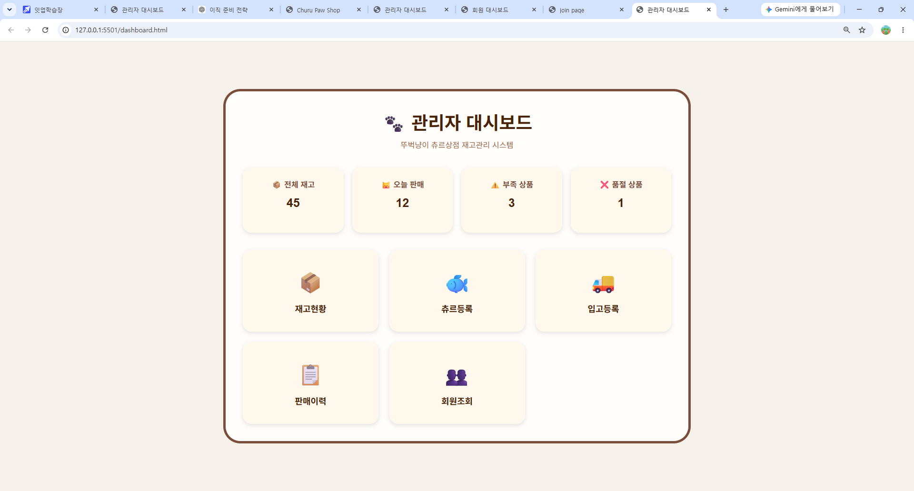

### 📦 재고 현황

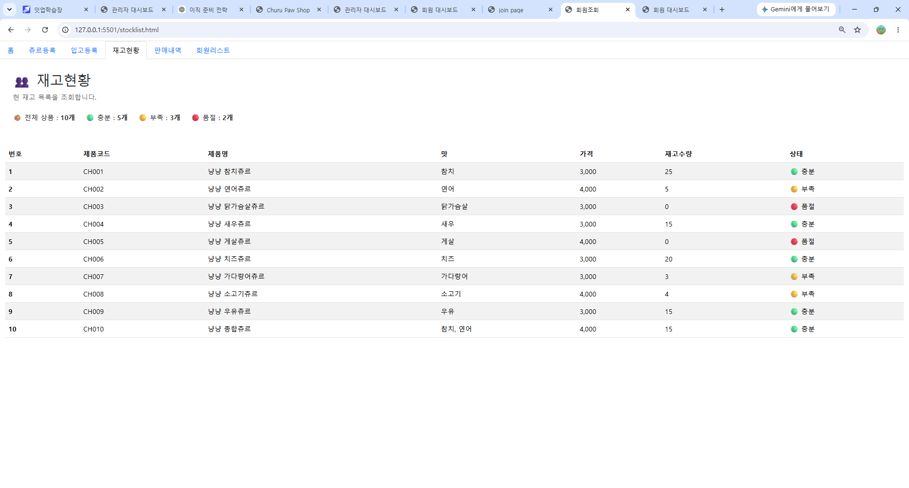

### 🐟 츄르 등록

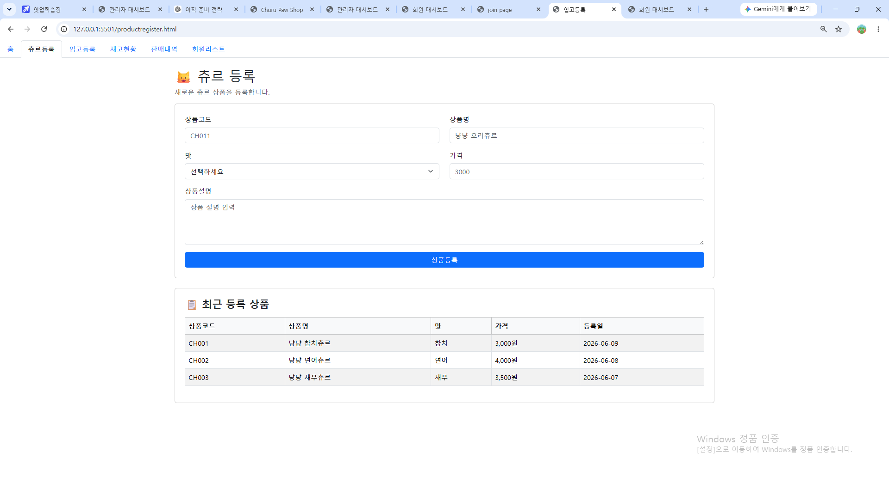

### 🚚 입고 등록

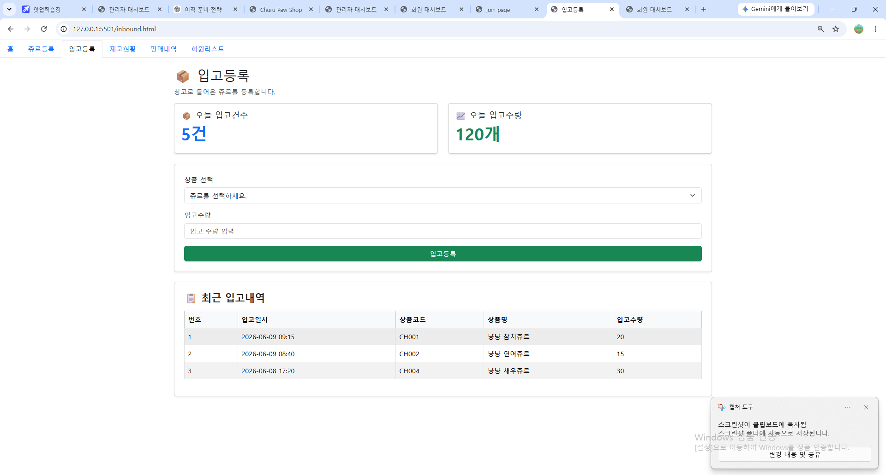

### 📋 판매 내역

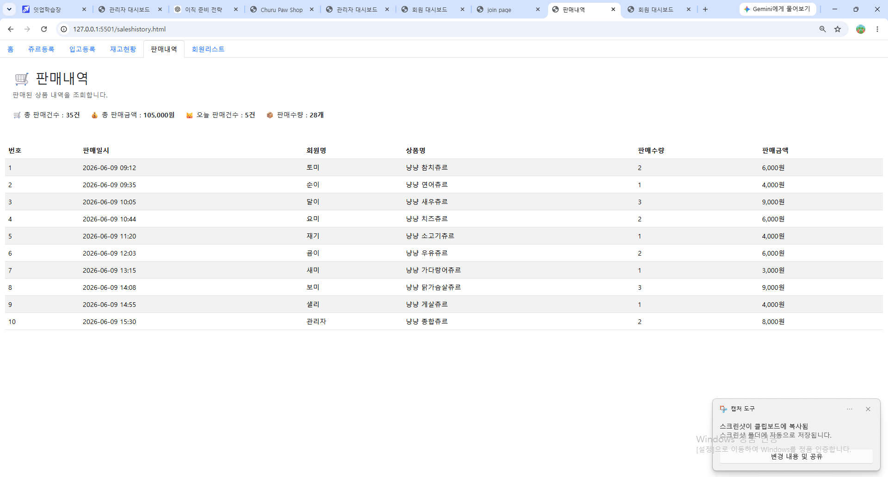

### 👥 회원 조회

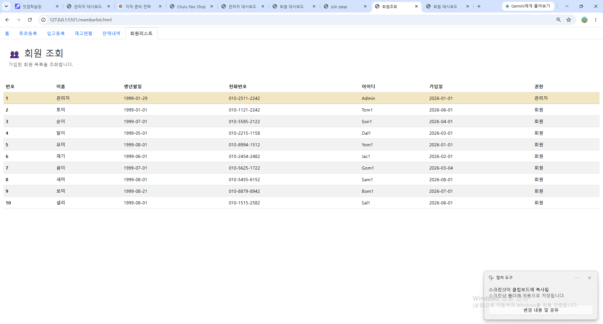

### 🐾 회원 대시보드

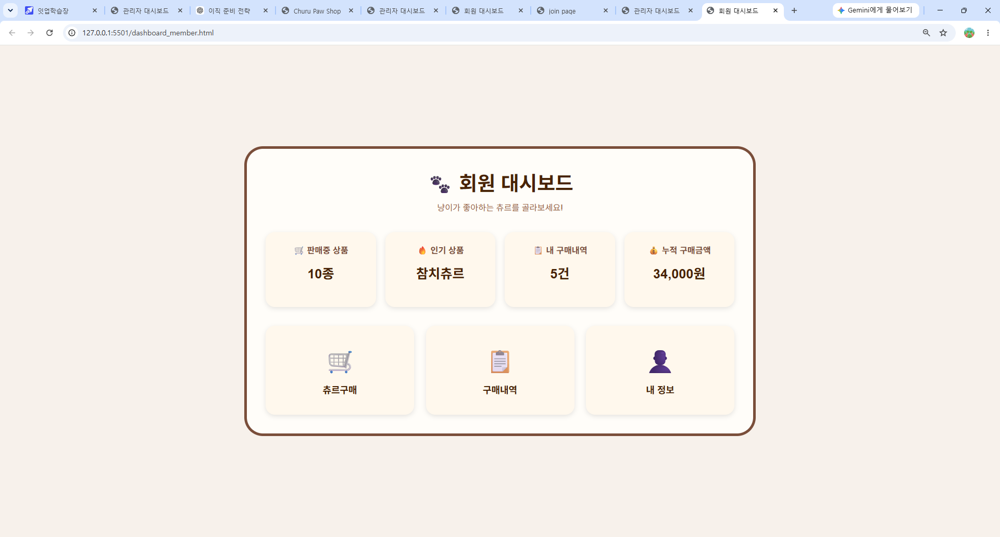

### 🛒 츄르 구매

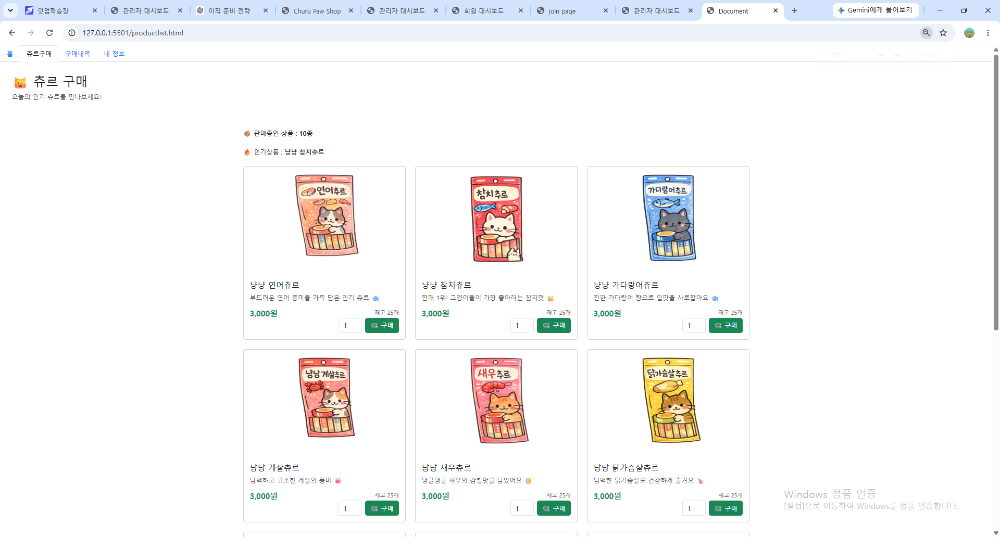

### 📄 구매 내역

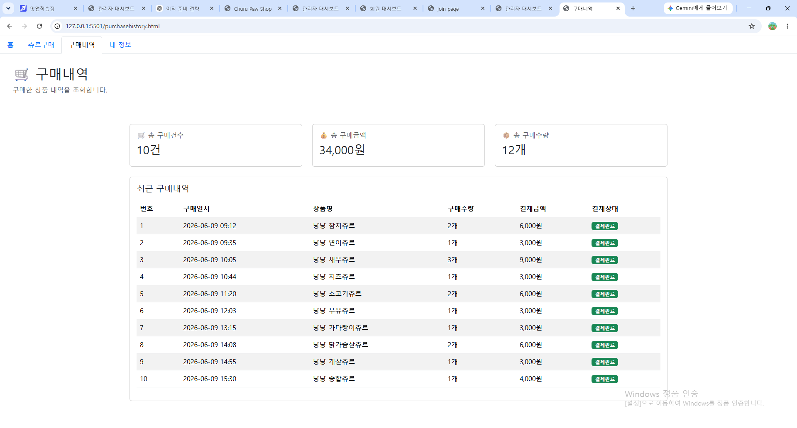

### 👤 내 정보

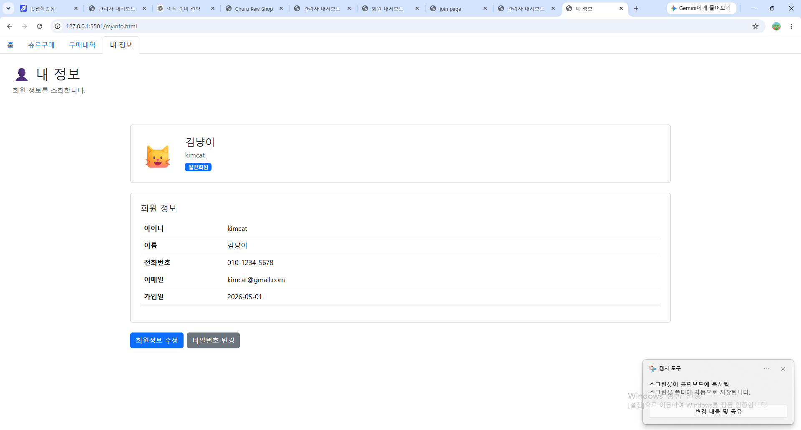

---

## 📚 향후 개발 예정

- JavaScript를 활용한 화면 동작 구현
- Java 기반 비즈니스 로직 구현
- Oracle Database 연동
- 로그인 / 회원가입 기능 구현
- 상품 구매 기능 구현
- 입고 시 재고 자동 반영
- 구매 시 재고 차감 처리
- 관리자 / 회원 권한 분리